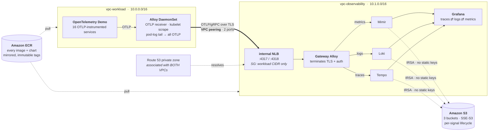
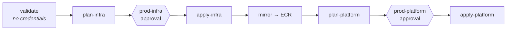
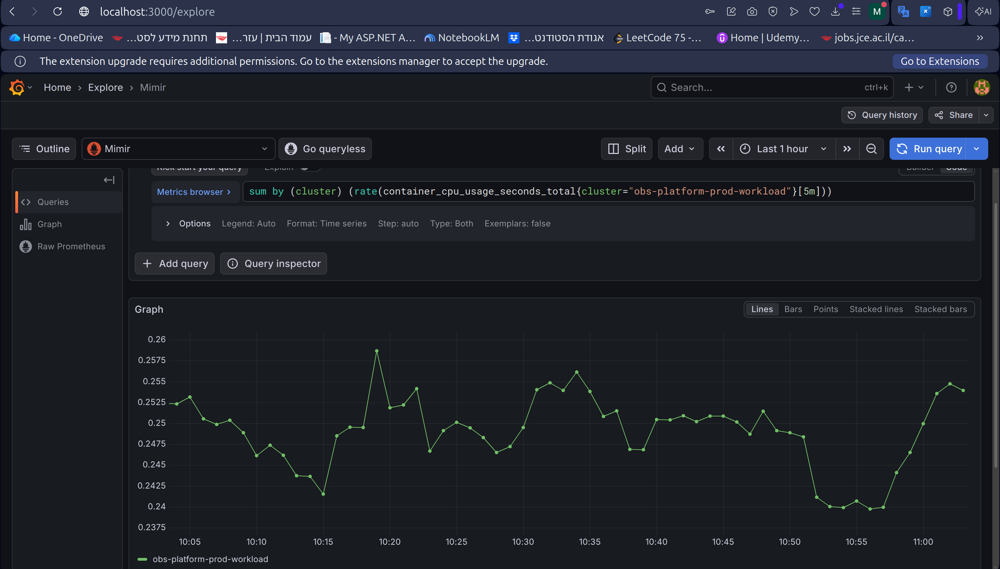
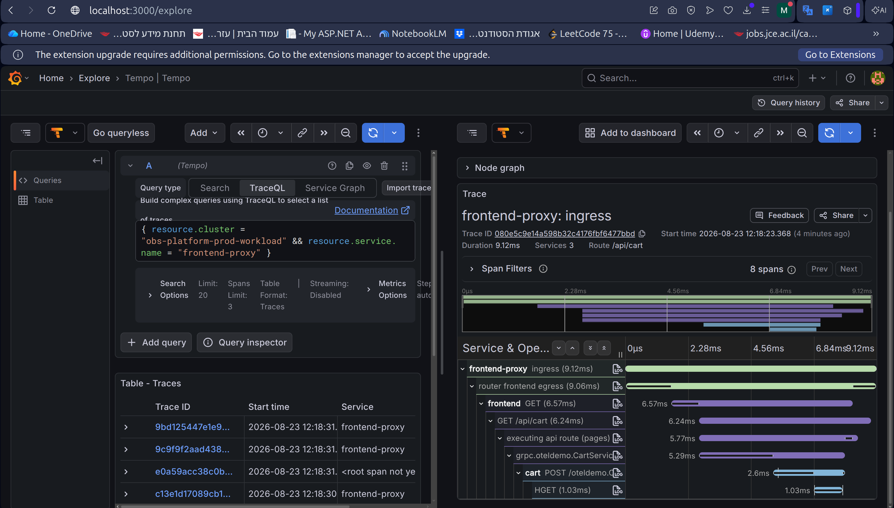
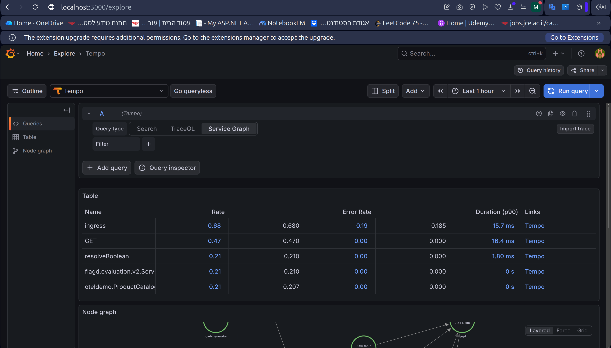
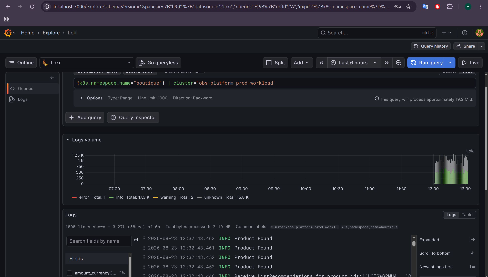

# Multi-Cluster Observability Platform on AWS EKS

[](https://github.com/MuhammadMarmash/eks-multi-cluster-observability/actions/workflows/ci.yaml)
[](https://www.terraform.io/)
[](https://aws.amazon.com/eks/)
[](https://grafana.com/oss/)
[](.github/workflows/deploy.yaml)
[](LICENSE)

**Two EKS clusters, two VPCs, one private telemetry pipeline.** An application fleet ships
metrics, logs and traces across a VPC peering link to a centralised **LGTM stack** whose
durable data lives entirely in **S3** — so the observability cluster can be destroyed and
rebuilt without losing a single sample.

Every layer is Terraform. Nothing is pulled from a public registry at deploy time, no
component holds a long-lived AWS key, and the CI pipeline cannot apply anything until a
human has approved it — enforced by an **IAM trust policy**, not just a workflow setting.

---

## Architecture



**The data path in one line:** app → local Alloy → *(TLS + basic auth over peering)* →
gateway Alloy → Mimir / Loki / Tempo → S3, with Grafana reading back over HTTP.

---

## Tech stack

**Infrastructure**
Terraform ≥ 1.11 · AWS EKS · VPC Peering · Route 53 private zones · Network Load Balancer ·
S3 with native state locking · KMS

**Kubernetes & observability**
Grafana Alloy · Mimir · Loki · Tempo · Grafana · cert-manager · AWS Load Balancer Controller ·
metrics-server · Helm

**Security & supply chain**
IRSA (IAM Roles for Service Accounts) · GitHub OIDC federation · Amazon ECR with immutable
tags and scan-on-push · TLS terminated in-cluster by cert-manager

**CI/CD**
GitHub Actions · OIDC (no static credentials) · GitHub Environments as approval gates ·
`terraform test` with `mock_provider`

---

## What's interesting here

- **Zero long-lived credentials, anywhere.** Loki, Mimir and Tempo reach S3 through **IRSA**;
  GitHub Actions reaches AWS through **OIDC federation**. There is no access key in the repo,
  in a Secret, or in GitHub — by construction, not by policy.
- **The approval gate is enforced by AWS, not GitHub.** The CI apply role's trust policy pins
  `repo:OWNER/REPO:environment:prod-infra`, so a workflow edited to skip the protected
  Environment **cannot obtain credentials at all**. ([ADR 0008](docs/adr/0008-two-stage-terraform.md))
- **Three IAM roles, one per signal.** Loki's role cannot read a single metric or trace. Each
  policy names every permitted action — no `s3:*`, no wildcard resources.
  ([ADR 0010](docs/adr/0010-cloud-native-storage-and-irsa.md))
- **Cross-cluster DNS solved below Kubernetes.** One Route 53 private zone associated with
  *both* VPCs, so no CoreDNS stub domain exists for an EKS add-on upgrade to silently
  overwrite. ([ADR 0007](docs/adr/0007-cross-cluster-name-resolution.md))
- **Exactly two ports cross the peering link.** Alloy converts Prometheus scrapes and pod-log
  tails into OTLP *in-process*, so all three signals leave on one authenticated connection.
  ([ADR 0006](docs/adr/0006-telemetry-agent-selection.md))
- **81 test cases, 186 assertions, no AWS account.** Every module ships `terraform test` files
  running under `mock_provider`, plus scripts that render every Helm values file against the
  real upstream charts and validate every Alloy config with the real Alloy binary.

---

## Design decisions

Ten ADRs record what was chosen, what it costs, and what was rejected.
Index: [`docs/README.md`](docs/README.md)

| ADR | Decision |
|---|---|
| [0001](docs/adr/0001-two-vpc-architecture.md) | Two VPCs — blast radius and VPC CNI IP exhaustion |
| [0002](docs/adr/0002-cross-vpc-telemetry-transport.md) | VPC peering over PrivateLink and public endpoints |
| [0003](docs/adr/0003-s3-native-state-locking.md) | S3 backend with native locking, no DynamoDB |
| [0004](docs/adr/0004-cluster-security-posture.md) | Private nodes, IRSA-only credentials, closed IMDS |
| [0005](docs/adr/0005-container-supply-chain.md) | Private ECR, immutable tags, scan-on-push |
| [0006](docs/adr/0006-telemetry-agent-selection.md) | Grafana Alloy as the unified agent |
| [0007](docs/adr/0007-cross-cluster-name-resolution.md) | Internal NLB + dual-associated private zone |
| [0008](docs/adr/0008-two-stage-terraform.md) | Two Terraform roots — infrastructure, then Kubernetes |
| [0009](docs/adr/0009-workload-application-source.md) | The workload app, pinned by repository |
| [0010](docs/adr/0010-cloud-native-storage-and-irsa.md) | Three S3 buckets, three IRSA roles, per-signal lifecycle |

**Runbooks**
[Telemetry pipeline](docs/RUNBOOK-telemetry.md) — deploy, verify, troubleshoot ·
[Day-2 operations](docs/runbooks/day-2-ops.md) — EKS upgrades and Mimir autoscaling

---

## Repository layout

```
terraform/
  bootstrap/            state bucket + GitHub OIDC provider and CI roles  (applied once, by hand)
  envs/prod/            STAGE 1 — VPCs, EKS, ECR, S3 buckets, IRSA roles
  envs/prod-platform/   STAGE 2 — the Kubernetes layer, reads stage 1 via remote state
  modules/              16 modules; none calls another
charts/telemetry-certs/ cert-manager issuers and certificates
scripts/                ECR mirroring · Alloy config validation · Helm values validation
.github/workflows/      ci · deploy · destroy
docs/adr/               10 architecture decision records
docs/runbooks/          Day-2 operations
```

---

## Getting started

**Prerequisites**

| | |
|---|---|
| **Tooling** | Terraform ≥ 1.11 · AWS CLI v2 · Helm 3 · Docker (with `buildx`) · `kubectl` · `jq` · GNU `make` |
| **AWS** | An account you are willing to spend roughly **$8–10/day** in, with permission to create VPCs, EKS clusters, IAM roles and OIDC providers |
| **GitHub** | Admin on the repository — CI needs repository *variables* and two *environments* |

> **The default `m7i-flex.large` is deliberate, not arbitrary.** On an AWS account on the
> **Free Plan**, `RunInstances` rejects any instance type that is not free-tier-eligible —
> `t3.medium` and `t3.large` among them. The symptom is unhelpful: the node group sits in
> `CREATING` for the full 30-minute timeout, `health.issues` stays empty, and no Auto Scaling
> group is ever created. The reason appears **only in CloudTrail**. If you change
> `node_instance_types`, check eligibility first:
> `aws ec2 describe-instance-types --filters Name=free-tier-eligible,Values=true`.

### 1. Bootstrap (once per account)

Creates the state bucket, the GitHub OIDC provider and the three CI roles.

```bash
cd terraform/bootstrap
cp terraform.tfvars.example terraform.tfvars   # bucket name + owner/repo
terraform init && terraform apply
terraform output github_actions_variables      # paste into GitHub → Settings → Variables
terraform output ci_role_arns                  # needed by step 2 — keep this handy
```

**Then wire up GitHub, before any CI run.** The apply and destroy jobs are gated on
[GitHub Environments](https://docs.github.com/en/actions/deployment/targeting-different-environments),
which do not exist until you create them. Under **Settings → Environments**, create both:

| Environment | Gates | Add |
|---|---|---|
| `prod-infra` | the infrastructure apply and destroy | at least one **required reviewer** |
| `prod-platform` | the Kubernetes apply and destroy | at least one **required reviewer** |

Without the required reviewer the environment exists but gates nothing, and `main` applies
straight to AWS unattended. The gate is enforced twice over: the apply roles' trust policies
are scoped to `environment:prod-infra` / `environment:prod-platform`, so a job that has not
passed the gate cannot obtain credentials at all — see [CI/CD](#cicd).

### 2. Deploy — three stages, and the order is load-bearing

```bash
cd terraform
cp envs/prod/backend.hcl.example envs/prod/backend.hcl        # bucket + KMS key from step 1
cp envs/prod/terraform.tfvars.example envs/prod/terraform.tfvars
```

**Now paste the bootstrap role ARNs into `cluster_admin_role_arns`** in that tfvars file —
your own SSO/IAM role, plus the plan and apply roles from `terraform output ci_role_arns`:

```hcl
cluster_admin_role_arns = [
  "arn:aws:iam::<account>:role/<you>",              # or you cannot run kubectl yourself
  "arn:aws:iam::<account>:role/<project>-ci-plan",  # plan-platform reads live cluster state
  "arn:aws:iam::<account>:role/<project>-ci-apply", # apply-platform writes it
]
```

Each entry becomes an **EKS access entry** granting `cluster-admin` on *both* clusters. The
`ci-ecr-push` role is deliberately absent — it only pushes images and never touches a cluster.

Get this wrong and the failure is late and confusing. Leave it empty and the clusters come up
reachable only by whichever principal ran `apply`: stage 3 fails at provider auth, and so does
every CI plan and apply of the Kubernetes layer. It is also the one value that is awkward to
repair after the fact, because fixing it from outside the cluster requires the very access it
grants.

```bash
make init && make plan && make apply    # 1. clusters, buckets, IAM   (~20 min)
make mirror                             # 2. charts + images into ECR
make platform-init
make platform-plan && make platform-apply   # 3. Kubernetes layer     (~15 min)

make verify                             # prints the end-to-end checks, with real names
```

Why each gate exists: **stage 3's providers configure themselves from clusters that must
already exist**, so it cannot even initialise before stage 1 finishes; and `helm_release`
**resolves charts at plan time**, so a chart stage 2 has not mirrored fails the *plan*, not
just the apply.

### 3. See it

```bash
terraform -chdir=envs/prod-platform output -raw grafana_admin_password
kubectl -n lgtm port-forward svc/grafana 3000:80
```

### 4. Tear down — reverse order

```bash
make platform-destroy   # MUST come first
make destroy
```

Destroying the clusters first leaves the platform state unable to configure the providers it
needs to clean itself up. `terraform destroy` will also **refuse** to delete non-empty LGTM
buckets — that is [ADR 0010](docs/adr/0010-cloud-native-storage-and-irsa.md) working as
designed.

### Verify without an AWS account

```bash
cd terraform
make validate         # all three root modules
make test             # 81 test cases / 186 assertions across 12 modules, via mock_provider
make alloy-validate   # renders each .alloy template, validates with the real Alloy binary
make lgtm-validate    # renders LGTM values against the real upstream charts
```

---

## CI/CD

Three workflows. Every job authenticates with a short-lived **OIDC token** — there is no AWS
key in GitHub Secrets.



### Branches

| Branch | What runs | What it can do |
|---|---|---|
| `development` | `ci.yaml` — lint, validate, 81 test cases, chart renders, read-only infra plan | Nothing. The plan role is read-only; there is no apply path off `main` |
| `main` | `deploy.yaml` — the gated chain above | Applies, but only after a human approves at the Environment gate |

Work lands on `development`, where every check runs against a read-only AWS role, and is
merged to `main` when it is ready to be deployed. The split is enforced rather than
conventional: `deploy.yaml` triggers only on `main`, and the `ci-ecr-push` role's trust
policy is pinned to `refs/heads/main`, so a branch cannot push to the registry both clusters
pull from even if its workflow tried.

| Workflow | Trigger | Purpose |
|---|---|---|
| [`ci.yaml`](.github/workflows/ci.yaml) | PR, push to any branch but `main` | fmt · validate · 81 test cases · chart renders · Alloy validation · infra plan |
| [`deploy.yaml`](.github/workflows/deploy.yaml) | push to `main`, manual | the gated chain above |
| [`destroy.yaml`](.github/workflows/destroy.yaml) | manual only | teardown, platform first, typed confirmation |

Both workflows also run `check-aws-string-constraints.sh` and `check-mirror-repos.sh` —
guards written after live failures, described in Lessons learned.

Three roles: **plan** (read-only), **apply** (only assumable from a protected Environment),
**ecr-push** (`main` only — `mirror-images.sh` is in-tree, so a PR must not decide what lands
in the registry both clusters pull from). Actions are pinned by **commit SHA**, not tag.

**No `tfplan` is ever uploaded as an artifact.** A saved plan holds secrets in plaintext and
artifacts are readable by anyone with repo access, so the apply job re-plans under a
concurrency lock.

---

## Proof of life

All three signals, collected on **Cluster A** and read from Grafana on **Cluster B**.

| | |
|---|---|
|  |  |
| **Metrics** — container CPU from Cluster A's kubelets, grouped by `cluster` | **Traces** — one request across 3 services and 8 spans, `frontend-proxy → frontend → cart → HGET` |
|  |  |
| **Service graph** — RED metrics and topology, from span metrics Tempo writes into Mimir | **Logs** — ~33k lines from the application namespace, labelled with their origin cluster |

Every query filters on `obs-platform-prod-workload`, a label stamped by the Alloy agent on
Cluster A and by nothing else — so the data crossed the peering link, authenticated at the
gateway, and was written to S3.

[`docs/proof-of-life/`](docs/proof-of-life/) has the queries, the same claims as raw API
responses, and the two gotchas worth knowing before reproducing it.

## Lessons learned

**1. `t3.large` → `t3.medium` cost 3× more memory than the spec sheet says.**
EKS reserves `255Mi + 11Mi × max_pods` per node. Prefix delegation raises max_pods to **110**,
so kube-reserved is **1465 MiB per node regardless of instance size** — 18% of a t3.large but
**36% of a t3.medium**. Two t3.medium nodes yield **4.75 GiB allocatable, not the ~6.5 GiB** a
naive reading gives, and the LGTM stack does not fit. The fix was three nodes rather than two,
which still costs less than the two t3.large it replaced. Since both instance types have the
same 2 vCPU, the downgrade cost memory only.

The account then had the last word: it is on the AWS Free Plan, which rejects `RunInstances`
for any type that is not free-tier-eligible — including `t3.medium`. The node group sat in
`CREATING` for the full 30-minute timeout with an empty `health.issues` and no Auto Scaling
group, and the reason appeared only in CloudTrail. The platform runs on `m7i-flex.large`,
which *is* eligible and carries 8 GiB, so the constraint that looked like a blocker produced
a better answer than the original plan.

**2. Helm ignores keys it does not recognise — silently.**
Rendering every values file against the real upstream charts (`make lgtm-validate`) caught
three defects no unit test could:

- `mimir-distributed` ships `kafka.enabled: true`, rendering an entire **Kafka StatefulSet with
  a 5Gi PVC** for an ingest path nothing here uses.
- The Loki chart's key is `persistence.volumeClaimsEnabled`, **not** `persistence.enabled`. My
  values *looked* correct while the StatefulSets kept their PVCs.
- Setting `image.registry: ""` makes charts emit `"" + "/" + repository` — a **leading slash**
  and an unpullable reference. It passes every values assertion and fails as
  `ImagePullBackOff` on a live cluster.

The lesson generalised: **assert on rendered output, not on your own inputs.** The same
principle caught `otelcol.exporter.debug` being an *experimental* component that Alloy refuses
to start with at the default stability level.

**3. A security group can be perfectly written and still match nothing.**
The peering security group restricting ingest to the workload VPC CIDR was attached to
Cluster B's **nodes**. But the NLB uses `ip` target type, for which **client-IP preservation is
off by default** — traffic reaching the pod appears to come from the load balancer, not from
Cluster A. The CIDR rule was real, correct, and quietly matched nothing. It had to move onto
the **NLB itself**.

**4. Writing the Day-2 runbook found two gaps that contradicted claims the platform made.**
The gateway Alloy had no PodDisruptionBudget and no anti-affinity, so a single node drain could
evict both replicas and take ingest to zero — undermining the "bounded telemetry gap" the
design depended on. And metrics-server was not installed anywhere, which does not degrade an
HPA so much as prevent one from ever functioning. Both are now fixed. **Documenting a system
honestly is a test of it.**

**5. GitHub's OIDC subject claim is not what the AWS documentation assumes.**
Every guide scopes the trust policy on `sub`, e.g. `repo:owner/repo:environment:prod-infra`.
This repository has **immutable subject claims** enabled, so the token GitHub actually issues
reads `repo:owner@66663930/repo@1340503365:environment:prod-infra` — the numeric IDs make the
claim survive a rename, and make every literal `sub` condition fail. The error is
`Not authorized to perform sts:AssumeRoleWithWebIdentity`, which says nothing about why.

Dropping the `sub` condition is not an option either: **AWS refuses to save a GitHub OIDC
trust policy that constrains neither `sub` nor `job_workflow_ref`.** So the `sub` condition
stays as a deliberately permissive `StringLike` (`repo:owner*/repo*:*`) purely to satisfy that
rule, and the real pinning moved to claims that are not rewritten — `repository`,
`environment` and `ref`, matched with `StringEquals`. The gate is *stronger* for it: the
apply role is now scoped on the environment claim directly, so a job that skipped the
approval cannot mint credentials at all. Finding it took decoding a live token in a
throwaway workflow; no amount of reading the policy would have shown it.

---

## Cost

Roughly per month in `eu-west-1` with committed defaults, if left running:

| Item | Cost |
|---|---|
| 2 × EKS control plane | ~$146 |
| 4 × `m7i-flex.large` (2 per cluster) | ~$280 |
| 2 × NAT gateway | ~$65 |
| 1 × internal NLB | ~$17 |
| S3 · ECR · KMS · flow logs | ~$10–20 |

**Idle clusters burn the budget.** `make platform-destroy` reclaims the NLB and the LGTM stack
without touching the clusters; `make destroy` takes the rest.

---

## License

[MIT](LICENSE) © Mohammad Marmash
