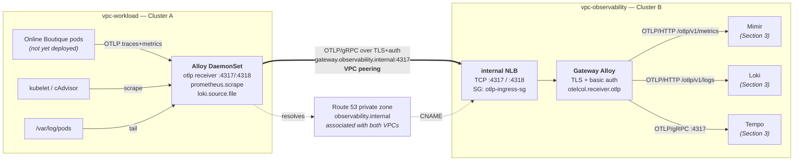

# Cross-cluster telemetry pipeline — design

**Date:** 2026-08-21
**Status:** Draft, awaiting review
**Implements:** [`FINAL_PROJECT_MISSION.md`](../../../FINAL_PROJECT_MISSION.md) Section 2 — The Data Pipeline
**Constrained by:** [ADR 0002](../../adr/0002-cross-vpc-telemetry-transport.md), [ADR 0004](../../adr/0004-cluster-security-posture.md), [ADR 0005](../../adr/0005-container-supply-chain.md)

---

## 1. Problem

The infrastructure layer is complete: two VPCs, a peering connection, two EKS clusters, an
ECR registry. Nothing runs on either cluster. Telemetry has to get from Cluster A to
Cluster B, over the peering link, with TLS and authentication, and none of it may rest
permanently on Cluster A.

Three constraints from work already committed shape everything below:

1. **Only `4317`/`4318` cross the peering link.** `modules/security` opens those two ports
   from the workload VPC CIDR and nothing else. ADR 0002 states that TLS and auth
   terminate at a Gateway Collector inside Cluster B. This design honours that literally —
   Cluster A never talks to Loki, Mimir or Tempo directly.
2. **Cluster A's CoreDNS cannot resolve Cluster B's Services.** The two clusters share no
   DNS namespace. A resolvable, stable name for the gateway has to be built.
3. **ADR 0005 forbids pulling from public registries at deploy time.** Third-party charts
   and images must be mirrored into ECR.

## 2. Scope

**In scope**

- AWS Load Balancer Controller on Cluster B, so an internal NLB can be provisioned.
- Route 53 private hosted zone `observability.internal`, associated with **both** VPCs.
- cert-manager on Cluster B, issuing the gateway's server certificate from a self-signed CA.
- A **Gateway Alloy** deployment on Cluster B behind an internal NLB, terminating TLS and
  basic auth on `4317`/`4318`, fanning telemetry out locally over OTLP.
- A **Grafana Alloy DaemonSet** on Cluster A collecting metrics, logs and traces and
  shipping all three as OTLP to `gateway.observability.internal:4317`.
- A second Terraform root module for the Kubernetes layer.
- ECR mirroring of every third-party chart and image this layer needs.

**Explicitly out of scope** — each of these gets its own design cycle:

- Loki / Mimir / Tempo / Grafana Helm releases, their S3 buckets, their IRSA roles.
- The Google Online Boutique deployment on Cluster A.
- The CI/CD pipeline and the Proof-of-Life screenshot.
- Mimir ingester HPA and the EKS upgrade runbook.

Because the LGTM stack does not exist yet, the gateway ships with a **debug sink** enabled
and its LGTM exporters gated behind a variable. The pipeline is end-to-end verifiable
today; Section 3 flips one flag.

## 3. Architecture



One signal path, one port, one credential. Everything Cluster A knows about Cluster B is a
DNS name, a CA certificate and a password.

## 4. How name resolution actually works

This is the question the pipeline lives or dies on, so it is worth stating step by step.
`allow_remote_vpc_dns_resolution` is already `true` on both sides of the peering connection
(`terraform/modules/security/main.tf`), which is a precondition for step 5.

1. An Alloy pod on Cluster A resolves `gateway.observability.internal`. The name matches no
   `cluster.local` suffix and no stub domain, so CoreDNS forwards it to the upstream
   resolvers from the node's `/etc/resolv.conf` — the Amazon-provided resolver at the
   workload VPC's base address `+2`.
2. That resolver is authoritative for `observability.internal`, because the private hosted
   zone is **associated with `vpc-workload`** as well as `vpc-observability`. This
   association is the entire trick: without it the query would leak to the public internet
   and NXDOMAIN.
3. The record is a **CNAME** to the internal NLB's AWS-generated name,
   `k8s-<hash>.elb.<region>.amazonaws.com`.
4. The resolver follows the CNAME. An internal NLB only ever has private addresses, and
   with remote DNS resolution enabled across the peering connection the answer returned to
   a querier in `vpc-workload` is the NLB's private IPs in `vpc-observability`'s private
   subnets.
5. The pod connects. The private route tables in `vpc-workload` carry a route for the
   observability CIDR via the peering connection, so the packet never touches a NAT
   gateway or the internet.
6. The NLB's security group — `otlp-ingress-sg`, the one `modules/security` already
   builds — admits `4317`/`4318` from the workload VPC CIDR and drops everything else.

**No CoreDNS configuration change is required on either cluster.** No stub domain, no
`forward` plugin edit, no `rewrite` rule. The resolution happens entirely in Route 53 and
the VPC resolver, below Kubernetes. That is deliberate: CoreDNS ConfigMap surgery is
fragile across EKS add-on upgrades, and this design has none of it.

### Where the security group attaches

`otlp-ingress-sg` is currently attached to Cluster B's **nodes** by the root module. The
cross-VPC traffic actually arrives at the **NLB's** ENIs, so the Service will additionally
carry `service.beta.kubernetes.io/aws-load-balancer-security-groups` pointing at that same
group, with `aws-load-balancer-manage-backend-security-group-rules: "true"` so the
controller opens the corresponding node-side rules itself.

This matters because the NLB uses `ip` target type (VPC CNI pod IPs), and client-IP
preservation is off by default for IP targets — traffic reaching the pod appears to come
from the NLB, not from Cluster A. Enforcing at the NLB is where the CIDR restriction has
teeth. The node-side attachment stays as defence in depth.

## 5. Trust: TLS and authentication

**Certificate.** cert-manager on Cluster B holds a self-signed root CA (`ClusterIssuer` of
type `ca`, seeded by a self-signed bootstrap issuer). It issues a server certificate with
SAN `gateway.observability.internal`. The NLB is a **pure TCP passthrough** — it terminates
nothing. TLS terminates at the Gateway Alloy pod, exactly as ADR 0002 describes.

ACM was rejected: a Route 53 *private* zone offers no way to prove domain ownership for a
public ACM certificate, and ACM Private CA costs roughly $400/month against a $50 budget.

**Distributing the CA.** Terraform reads the CA certificate out of Cluster B with
`data "kubernetes_secret"` and writes it into a Secret on Cluster A, mounted into the Alloy
DaemonSet. This is what lets Cluster A run with `insecure_skip_verify` genuinely `false`
and a real `ca_file` — the verification is not theatre.

**Credential.** A Terraform `random_password` becomes a Kubernetes Secret in both clusters.
Cluster A's Alloy injects it via `alloy.extraEnv` and references it with `sys.env()` in an
`otelcol.auth.basic` block; the gateway's `otelcol.receiver.otlp` validates against the
same component on its `grpc` and `http` blocks. The value is never in git; it does live in
Terraform state, which is S3-encrypted per ADR 0003.

**Rotation.** Changing `random_password`'s keepers rotates the credential; both Secrets and
both Helm releases update in one apply. The certificate rotates on cert-manager's own
schedule, and the CA read is re-run on every apply, so a CA rotation propagates to Cluster
A without manual work.

## 6. Terraform layout

`terraform/envs/prod` is **not modified** by this work, except for adding mirror
repositories to the `ecr_repositories` variable value. Everything new lands in a second
root module.

```
terraform/
  envs/
    prod/                      unchanged  — AWS infrastructure
    prod-platform/             NEW        — the Kubernetes layer
  modules/
    irsa/                      NEW  generic IRSA role factory (reused by Section 3)
    dns-private-zone/          NEW  Route 53 PHZ + multi-VPC association
    aws-lb-controller/         NEW  IRSA role + Helm release
    cert-manager/              NEW  Helm release + issuer/certificate chart
    telemetry-gateway/         NEW  Cluster B Alloy gateway, NLB Service, secrets
    telemetry-agent/           NEW  Cluster A Alloy DaemonSet, secrets
charts/
  telemetry-certs/             NEW  tiny local chart: ClusterIssuer + Certificate
scripts/
  mirror-images.sh             NEW  ECR mirroring for charts and images
```

**Why a second root module.** The `helm` and `kubernetes` providers need cluster endpoints
and auth to configure themselves. Deriving that from resources created in the same apply is
the classic Terraform anti-pattern: it plans badly on green-field and worse on destroy, and
a failed Helm release taints infrastructure state. `prod-platform` reads `prod` through
`terraform_remote_state` and configures four aliased providers —
`helm.workload`, `helm.observability`, `kubernetes.workload`, `kubernetes.observability` —
with `exec` auth against `aws eks get-token`. Apply order becomes `prod` then
`prod-platform`, which is also the natural shape for two ordered CI jobs in Section 4.

**Why the private zone lives in `prod-platform`.** It is an AWS resource and could sit in
`prod`, but its DNS record must point at an NLB that does not exist until Helm has run.
Splitting the zone from the record across two states would be worse than keeping both in
the layer that owns the load balancer.

**Why `charts/telemetry-certs` is a local Helm chart rather than `kubernetes_manifest`.**
`kubernetes_manifest` requires the CRD to be registered at *plan* time, so a fresh apply
that installs cert-manager and its `Certificate` in one run cannot plan. Wrapping the two
custom resources in a Helm release sidesteps this completely.

## 7. Cluster A — the Alloy DaemonSet

Deployed from the `grafana/alloy` chart (mirrored to ECR as an OCI chart) with
`controller.type: daemonset`, `mounts.varlog: true`, `rbac.create: true`. RBAC gives
read-only `get/list/watch` on pods, nodes, namespaces, services and endpoints, plus
`nodes/metrics` and `nodes/proxy` for kubelet scraping.

Three collection paths converge on one exporter:

| Signal | Components |
|---|---|
| **Traces + app metrics** | `otelcol.receiver.otlp` on `:4317`/`:4318`, cluster-local and plaintext — the Boutique pods are in the same cluster, and the peering link is the trust boundary, not the pod network |
| **Infra metrics** | `discovery.kubernetes` (role `node`) → `prometheus.scrape` against kubelet and cAdvisor with the ServiceAccount bearer token → `otelcol.receiver.prometheus` bridges Prometheus into OTLP |
| **Pod logs** | `discovery.kubernetes` (role `pod`, field-selected to the local node) → `discovery.relabel` stamping `namespace`/`pod`/`container`/`app` and building `__path__` → `loki.source.file` tailing `/var/log/pods` → `otelcol.receiver.loki` bridges Loki into OTLP |

Node-scoped pod discovery via `spec.nodeName=$HOSTNAME` matters: without it every Alloy
instance in the DaemonSet lists every pod in the cluster, and the API server pays for it.

All three then run through `otelcol.processor.k8sattributes` (pod, namespace, node,
workload metadata), `otelcol.processor.transform` stamping
`cluster = "<project>-prod-workload"` so Grafana can tell the two clusters apart — this is
what the Proof-of-Life screenshot depends on — and `otelcol.processor.batch` before a
single `otelcol.exporter.otlp` with:

```alloy
client {
  endpoint = "gateway.observability.internal:4317"
  auth     = otelcol.auth.basic.gateway.handler
  tls {
    ca_file    = "/etc/alloy/certs/ca.crt"
    insecure   = false
  }
}
```

`otelcol.processor.memory_limiter` sits at the head of the pipeline so a gateway outage
sheds load instead of OOM-killing the DaemonSet.

Config is rendered by `templatefile()` into `alloy.configMap.content`, so the cluster name,
gateway hostname and feature flags come from Terraform variables rather than being
hard-coded in a YAML file.

## 8. Cluster B — the Gateway Alloy

Same chart, `controller.type: deployment`, two replicas across AZs with a
`PodDisruptionBudget`. It is stateless; the NLB spreads load across pod IPs.

- `otelcol.receiver.otlp` with `grpc` and `http` blocks, each carrying a `tls` block
  (`cert_file`/`key_file` from the cert-manager Secret) and
  `auth = otelcol.auth.basic.ingest.handler`.
- `otelcol.processor.batch`, then three exporters — all OTLP, so the gateway performs no
  format conversion: `otelcol.exporter.otlphttp` to Mimir's `/otlp/v1/metrics`,
  `otelcol.exporter.otlphttp` to Loki's `/otlp/v1/logs`, `otelcol.exporter.otlp` (gRPC) to
  Tempo on `4317`.
- Those three are rendered only when `var.lgtm_enabled` is true. Until Section 3,
  `otelcol.exporter.debug` at `verbosity = "basic"` is the sink, and gateway pod logs are
  the proof that data arrived.

The Service is `type: LoadBalancer` with `aws-load-balancer-type: external`,
`aws-load-balancer-nlb-target-type: ip`, `aws-load-balancer-scheme: internal`, subnets
pinned to the observability private subnets, and the security-group annotations from §4.

## 9. Supply chain

Per ADR 0005, every third-party artefact is mirrored into ECR and every values file points
at the ECR registry. New repositories added to `envs/prod`'s `ecr_repositories`:

| Repository | Contents |
|---|---|
| `mirror/grafana/alloy` | Alloy image |
| `mirror/eks/aws-load-balancer-controller` | controller image |
| `mirror/jetstack/cert-manager-{controller,cainjector,webhook,startupapicheck}` | cert-manager images |
| `charts/{alloy,aws-load-balancer-controller,cert-manager}` | OCI Helm charts |

`scripts/mirror-images.sh`, wired to `make mirror`, pins every artefact to an exact version,
copies it in, and is idempotent against ECR's immutable-tag policy — a tag that already
exists is skipped rather than re-pushed. Section 4's pipeline calls the same script.

## 10. Verification

**Static, every change:**

- `terraform validate` and `terraform plan` on both root modules.
- `helm template` against the rendered values for all four releases, so a malformed chart
  value fails before an apply.
- `alloy fmt --verify` on both rendered `.alloy` configs. This is the one that earns its
  keep: an Alloy config error surfaces as a `CrashLoopBackOff` twenty minutes into an
  apply otherwise.

**Runtime, after apply:**

1. From a debug pod on Cluster A, `dig gateway.observability.internal` returns a private
   address inside the observability VPC CIDR. Fails here → the zone association is wrong.
2. `openssl s_client -connect gateway.observability.internal:4317 -CAfile ca.crt` verifies
   the chain and the SAN. Fails here → certificate or routing.
3. An unauthenticated OTLP POST to `:4318/v1/traces` is rejected. This is the negative
   test, and it is the one most likely to be skipped and most worth keeping.
4. Alloy's own `/metrics` on Cluster A shows `otelcol_exporter_sent_spans` and
   `otelcol_exporter_sent_log_records` climbing with `otelcol_exporter_send_failed_*` flat.
5. Gateway pod logs show the debug exporter printing spans whose resource attributes carry
   `cluster="<project>-prod-workload"`.

Step 5 is the definition of done for this spec.

## 11. Risks

| Risk | Mitigation |
|---|---|
| cert-manager has not issued the certificate when Terraform reads the CA Secret | `time_sleep` after the certs chart plus `helm_release.wait = true`; a first-apply failure is re-runnable and idempotent |
| NLB provisioning takes ~3 minutes; the Route 53 record depends on its hostname | Record reads the Service's `status.loadBalancer.ingress[0].hostname` through a `kubernetes_service` data source with `depends_on` the release |
| Two-stage apply is easy to run out of order | `make` targets that enforce the order, and `prod-platform` fails loudly if the remote state has no cluster outputs |
| `otelcol.auth.basic` server-side supports a single credential | Acceptable for one client. Multi-tenant ingest is a Section 3 concern and would move to per-tenant tokens |
| Peering carries the traffic but is bidirectional by nature | Unchanged from ADR 0002: routing, security groups and application auth are three independent layers, and this design adds the third |

## 12. Follow-on ADRs

Written alongside the implementation, in the established house style:

- **0006** — Grafana Alloy as the unified telemetry agent, over the upstream OTel Collector
  plus Promtail plus a Prometheus agent.
- **0007** — Gateway topology and cross-cluster name resolution: internal NLB plus a
  dual-associated Route 53 private zone, over CoreDNS stub domains or a public endpoint.
- **0008** — Two-stage Terraform: an infrastructure root and a platform root, over a single
  root or a GitOps controller.

ADR 0002 needs no amendment. This design is the implementation it anticipated.
